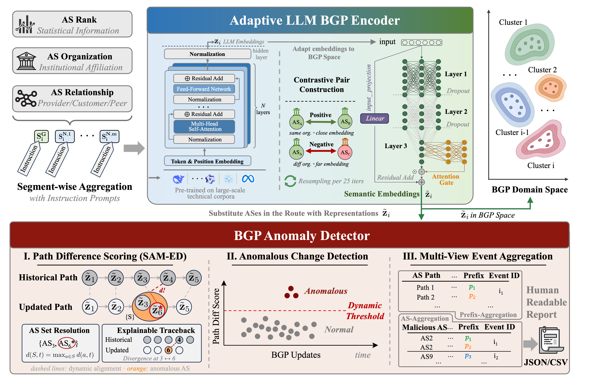

## System Architecture

BGPShield consists of two core modules operating in a sequential pipeline:

### Overview



```
routing-anomaly-detection/
├── BGPShield/                   # Adaptive LLM BGP Encoder
│   ├── iterative_as_embeds.py   # embed AS profiels
│   ├── train.py                 # train the Adapter
│   └── Adapter.py               # Lightweight Adapter
├── anomaly_detector/            # BGP Anomaly Detector
│   ├── diff_evaluator_routeviews.py    # SAM-ED path difference
│   ├── llm_report_anomaly_routeviews.py # Anomaly detection
│   └── utils.py                 # Utility functions
├── routing_monitor/             # Route monitoring
│   ├── all_route_monitor.py     # Collect route changes from 40+ vantage points 
│   └── llmmonitor.py            # AS description construction
├── post_processor/              # Result aggregation
│   ├── alarm_postprocess_routeviews.py
│   ├── rpki_validation_request.py
│   └── summary_routeviews.py
├── data/                        # Data storage
│   ├── bgpstream/
│   ├── caida_as_org/
│   ├── caida_as_rel/
│   └── routeviews/
└── pipeline.sh                  # One-command execution script
```

## Quick Start with pipeline.sh

The `pipeline.sh` script automates the entire BGPShield workflow, from data collection to anomaly report generation.

### Basic Usage

```bash
./pipeline.sh --year 2008 --month 2 --day 24 --hour 18 --minute 47 \
              --device 0 --reduce True --type ribs
```

### Complete Parameter Reference

```bash
./pipeline.sh \
    --year YYYY \          # Event year (e.g., 2008)
    --month MM \           # Event month (1-12)
    --day DD \             # Event day (1-31)
    --hour HH \            # Event hour in UTC (0-23, default: 12)
    --minute MM \          # Event minute (0-59, default: 0)
    --device GPU_ID \      # GPU device ID (default: 0)
    --reduce BOOL \        # Enable dimensionality reduction (True/False)
    --type DATA_TYPE \     # Data source type (updates/ribs)
    [--llm BOOL] \         # Use LLM embeddings (default: True)
    [--bert BOOL]          # Use BGE-M3 model (default: False)
```

### Parameter Details

#### Required Parameters

- **`--year`, `--month`, `--day`**: Specify the BGP anomaly event date (UTC timezone)
  - Example: `--year 2008 --month 2 --day 24` for the YouTube hijack incident
  
- **`--device`**: GPU device ID for computation
  - Use `nvidia-smi` to check available GPUs
  - Example: `--device 0` (uses GPU 0)

- **`--reduce`**: Enable/disable Adapter in ALBE
  - `True`: Apply Adapter to align and compress embeddings to BGP Space (dimension: 16) (recommended)
  - `False`: Use raw LLM BGP embeddings

- **`--type`**: BGP data source type
  - `updates`: Use UPDATE files (for recent events, post-2015)
  - `ribs`: Use RIB snapshots (for historical events or sparse data periods)

#### Optional Parameters

- **`--hour`, `--minute`**: Specify exact event time
  - Default: `12:00` UTC if not specified
  - Example: `--hour 18 --minute 47` for 18:47 UTC
  - **Data collection window**: ±12 hours from specified time

- **`--llm`**: Choose detection method
  - `True` (default): Use BGPShield with LLM embeddings
  - `False`: Use BEAM baseline for comparison

- **`--bert`**: Select LLM model (only effective when `--llm True`)
  - `False` (default): Use DeepSeek-R1-Distill-Llama-8B
  - `True`: Use BGE-M3 model

---

## Pipeline Workflow

The `pipeline.sh` script executes the following stages sequentially:

### Stage 1: AS Embedding Generation (ALBE Module)
- Downloads CAIDA AS relationship data
- Constructs AS profiles
- Train ALBE with a contrastive loss 
- Generate adaptive LLM BGP embeddings (dimension: 16)

### Stage 2: Route Change Detection (BAD Module)
- Downloads RouteViews data (RIBs + UPDATEs)
- Identifies route changes in ±12h window

### Stage 3: Path Difference Computation
- Applies AR-DTW algorithm to compute semantic distances
- Generates path difference scores

### Stage 4: Anomaly Detection & Aggregation
- Applies adaptive thresholding
- Aggregates anomalies into events
- Attributes responsible ASes

### Stage 5: Report Generation
- Validates RPKI status
- Identifies anomaly properties
- Generates HTML/JSON/CSV reports
---


## Example Use Cases

### 1. YouTube Hijack (February 2008)

Historical event requiring RIB data:

```bash
./pipeline.sh --year 2008 --month 2 --day 24 --hour 18 --minute 47 \
              --device 0 --reduce True --type ribs
```

**Note**: Events before 2015 should use `--type ribs` due to limited UPDATE file availability.

### 2. Vodafone Route Leak (April 2021)

Recent event with abundant UPDATE data:

```bash
./pipeline.sh --year 2021 --month 4 --day 16 --hour 12 --minute 0 \
              --device 1 --reduce True --type updates
```

### 3. CelerBridge Hijack (August 2022) - Using BGE-M3

Test with alternative LLM model:

```bash
./pipeline.sh --year 2022 --month 8 --day 17 --hour 12 --minute 0 \
              --device 0 --reduce True --type updates --bert True
```

### 4. Comparison with BEAM Baseline

Run BEAM for performance comparison:

```bash
./pipeline.sh --year 2020 --month 4 --day 1 --hour 12 --minute 0 \
              --device 0 --reduce False --type updates --llm False
```

### 5. Recent Event (2025) - Testing Generalization

Evaluate on unseen events after LLM training cutoff:

```bash
./pipeline.sh --year 2025 --month 11 --day 6 --hour 12 --minute 0 \
              --device 0 --reduce True --type updates
```
---
